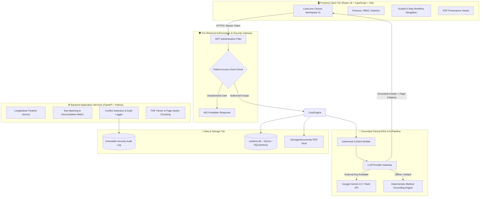
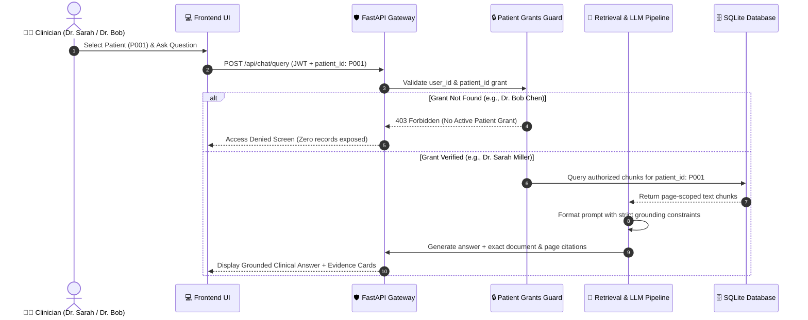

# CareLens AI — Secure Clinical History Intelligence

[](https://fastapi.tiangolo.com)
[](https://reactjs.org/)
[](https://vitejs.dev/)
[](https://ai.google.dev/)
[]()
[]()

> **Evidence-backed clinical history intelligence platform that securely retrieves, compares, reconciles, and visualizes longitudinal patient records with zero hallucination.**

---

## 📑 Table of Contents
- [Executive Overview](#-executive-overview)
- [Core Architectural Principles](#-core-architectural-principles)
- [Guided Clinical Workflow](#-guided-clinical-workflow)
- [Detailed Technology Stack](#-detailed-technology-stack)
- [System Architecture Diagram](#-system-architecture-diagram)
- [Project Directory & Folder Structure](#-project-directory--folder-structure)
- [Getting Started](#-getting-started)
  - [Prerequisites](#prerequisites)
  - [Backend Installation & Startup](#1-backend-setup)
  - [Frontend Installation & Startup](#2-frontend-setup)
  - [Environment Configuration](#3-environment-configuration)
- [Pre-Seeded Demo Personas](#-demo-personas-pre-seeded)
- [Automated Testing & Security Verification](#-automated-testing--verification)
- [Security & Compliance Guarantees](#-security--compliance-guarantees)

---

## 🌟 Executive Overview

In modern healthcare, patient records are fragmented across unstructured clinical consult notes, lab reports, surgical summaries, and diagnostic imaging PDFs. Clinicians lose valuable hours manually cross-referencing documents, resulting in:
- **Missed diagnostic test follow-ups** (ordered tests with missing lab outcomes).
- **Unnoticed record contradictions** (mismatched procedure dates, conflicting medication dosages).
- **Cognitive overload and burnout** across attending physicians and care teams.

**CareLens AI** provides a verifiable intelligence layer on top of clinical document archives. It extracts clinical milestones, reconciles test orders with diagnostic outcomes, flags inter-document contradictions, and allows clinicians to query records with **exact page-level provenance**.

---

## 🎯 Core Architectural Principles

- **Product Workflow (`Compare → Verify → Update`):**
  Clinicians are never forced to accept automated changes. Discrepancies are highlighted for explicit human review with an immutable audit trail.
- **Security Paradigm (`Authorize → Retrieve → Generate → Cite`):**
  Pre-retrieval authorization blocks unauthorized patient data before vector search, RAG retrieval, or prompt construction occurs.
- **Zero Hallucination Medical Grounding:**
  Answers are strictly anchored to verified document chunks with page citations and highlighted excerpts. If evidence does not exist in the record, the system explicitly reports insufficient data rather than making clinical assumptions.

---

## 🩺 Guided Clinical Workflow

CareLens structures complex clinical reviews into a dedicated 6-step verification sequence:

```
┌─────────────────────────────────────────────────────────────────────────────────────────────┐
│                                  GUIDED CLINICAL WORKFLOW                                   │
├──────────────┬──────────────┬──────────────┬──────────────┬──────────────────┬──────────────┤
│   STEP 01    │   STEP 02    │   STEP 03    │   STEP 04    │     STEP 05      │   STEP 06    │
│Review History│ Evidence AI  │ Match Tests  │Compare Cycles│ Resolve Conflicts│ Source Docs  │
│ (Timeline)   │(Grounded Q&A)│ (Reconcile)  │ (C1 vs C2)   │  (Human-in-Loop) │ (PDF Proven) │
└──────────────┴──────────────┴──────────────┴──────────────┴──────────────────┴──────────────┘
```

| Step | Module | Clinical Objective | Output / Value |
|---|---|---|---|
| **01** | **Review History** | Reconstruct multi-year medical journey | Interactive chronological timeline with direct PDF links |
| **02** | **Evidence AI** | Natural language medical Q&A | Grounded clinical answers with clickable source cards |
| **03** | **Match Tests** | Order vs. Lab outcome reconciliation | Matrix flagging `Matched`, `Pending`, or `Missing` tests |
| **04** | **Compare Cycles** | Baseline vs. Follow-up differential | Side-by-side progression analysis across clinical periods |
| **05** | **Resolve Conflicts**| Human-in-the-Loop reconciliation | Detects conflicting records & enables 1-click doctor sign-off |
| **06** | **Source Docs** | Authentic document audit | Integrated viewer with page-by-page highlighted proof |

---

## 💻 Detailed Technology Stack

| Layer | Technology | Version | Purpose & Architectural Justification |
|---|---|---|---|
| **Frontend UI** | **React** | `18.3.1` | Component-driven, responsive clinical workspace with real-time state updates |
| **Language (Client)** | **TypeScript** | `5.6.3` | Type-safe domain models for clinical facts, chunks, and reconciliation items |
| **Build & Dev Tool** | **Vite** | `5.4.9` | High-performance HMR and optimized production bundling |
| **Styling & Design** | **Tailwind CSS** | `3.4.17` | Curated dark mode, glassmorphic panels, and medical-grade visual hierarchy |
| **Icons & Assets** | **Lucide React** | `0.453.0` | Accessible clinical status indicators and workflow icons |
| **Backend API** | **FastAPI** | `>=0.115.0` | High-speed asynchronous REST gateway with auto-generated OpenAPI / Swagger docs |
| **Runtime (Server)** | **Python** | `3.10+` | Native ecosystem for NLP, RAG, and clinical data extraction |
| **ASGI Server** | **Uvicorn** | `>=0.30.0` | Production-grade asynchronous web server |
| **ORM & Models** | **SQLAlchemy** | `>=2.0.30` | Declarative relational schema management and type-safe query building |
| **Database** | **SQLite** | `3.x` | Zero-configuration embedded relational store (`carelens.db`) |
| **PDF Extraction** | **PyPDF** | `>=4.3.0` | Document text ingestion with exact page-number tracking |
| **Generative AI** | **Google Gemini** | `gemini-flash-latest` | High-throughput, low-latency grounded clinical reasoning via v1beta API |
| **Fallback Engine** | **Deterministic Rule-Engine** | Built-in | Zero-dependency, offline clinical reasoning when external keys are not present |
| **Auth & Security** | **PyJWT** | `>=2.9.0` | Role-Based Access Control (RBAC) tokens with patient-level scoping |
| **Test Suite** | **pytest** | `>=8.0.0` | Unit, integration, and security authorization test runner |

---

## 🏗️ System Architecture Diagram

### 1. High-Level Component Flow



### 2. Pre-Retrieval Authorization Sequence



---

## 📁 Project Directory & Folder Structure

```
Care_Lens/
├── .env                                # Active environment configuration
├── .env.example                        # Template environment variables
├── carelens.db                         # SQLite relational database (pre-seeded)
├── docker-compose.yml                  # Container orchestration specification
├── README.md                           # Comprehensive technical documentation
│
├── backend/                            # FastAPI Python Backend Application
│   ├── requirements.txt                # Python backend dependencies
│   ├── Dockerfile                      # Backend container definition
│   ├── tests/                          # Backend test suite
│   │   ├── __init__.py
│   │   ├── test_auth.py                # RBAC & authentication tests
│   │   ├── test_ingestion.py           # PDF extraction & chunking tests
│   │   ├── test_reconciliation.py      # Test matching logic tests
│   │   └── test_security.py            # Pre-retrieval authorization guard tests
│   │
│   └── app/                            # Core application source code
│       ├── main.py                     # FastAPI application factory & router registration
│       ├── api/                        # REST endpoint controllers
│       │   ├── auth.py                 # Authentication & login routes
│       │   ├── documents.py            # Document ingestion & retrieval routes
│       │   ├── patients.py             # Patient demographic & profile endpoints
│       │   ├── questions.py            # Evidence AI Q&A query endpoints
│       │   └── reconciliation.py       # Test matching & conflict endpoints
│       ├── audit/                      # Security audit trail logging
│       ├── auth/                       # JWT token generation & verification
│       ├── core/                       # Config, database engine, & structured logging
│       │   ├── config.py               # Pydantic environment settings
│       │   ├── database.py             # SQLAlchemy session & engine lifecycle
│       │   └── logging.py              # Centralized logging configuration
│       ├── ingestion/                  # PDF parsing, fact extraction, & validation
│       │   ├── chunking.py             # Page-aware text chunker
│       │   ├── facts.py                # Clinical entity & fact extractor
│       │   └── validation.py           # Document structure & integrity validator
│       ├── providers/                  # LLM & embedding providers
│       │   ├── embeddings.py           # Vector embedding generator
│       │   └── llm.py                  # Gemini API & Deterministic engine client
│       ├── reconciliation/             # Clinical reconciliation engines
│       │   ├── conflicts.py            # Contradiction & discrepancy detection
│       │   ├── cycle_comparison.py     # Cycle 1 vs Cycle 2 differential analyzer
│       │   └── test_matching.py        # Order vs. result matching matrix
│       ├── retrieval/                  # RAG context builder & citation generator
│       │   ├── citations.py            # Source document & page linker
│       │   └── context_builder.py      # Patient-scoped context assembler
│       ├── schemas/                    # Pydantic request/response schemas
│       └── security/                   # RBAC & Pre-retrieval access control guards
│
├── frontend/                           # React + TypeScript + Vite Client Application
│   ├── package.json                    # Node dependencies & npm scripts
│   ├── vite.config.ts                  # Vite configuration & dev server options
│   ├── tsconfig.json                   # TypeScript compiler configuration
│   ├── tailwind.config.js              # Tailwind CSS theme & glassmorphic tokens
│   ├── postcss.config.js               # PostCSS plugins configuration
│   ├── index.html                      # Single Page Application HTML entrypoint
│   │
│   └── src/                            # Frontend source code
│       ├── main.tsx                    # React DOM root entrypoint
│       ├── App.tsx                     # Main layout & persona switcher state
│       ├── index.css                   # Design tokens, animations, & glassmorphism
│       ├── api/                        # Axios / Fetch client configuration
│       ├── auth/                       # Auth components & persona switcher
│       │   └── components/
│       │       └── UserSwitcher.tsx    # Header persona & RBAC switcher
│       ├── components/                 # Shared UI components
│       │   └── ui/
│       │       ├── AccessDenied.tsx    # 403 Pre-Retrieval Authorization banner
│       │       └── Navbar.tsx          # Top clinical navigation bar
│       ├── types/                      # TypeScript domain definitions
│       │   └── index.ts                # Patient, Chunk, Event, & Reconciliation types
│       └── workspace/                  # 6-Step Guided Workflow Modules
│           ├── components/
│           │   ├── CycleComparison.tsx # Step 04: C1 vs C2 side-by-side comparison
│           │   ├── EvidenceAI.tsx      # Step 02: Grounded Q&A with Gemini
│           │   ├── EvidenceViewer.tsx  # Step 06: PDF viewer with highlighted citations
│           │   ├── PatientBanner.tsx   # Top patient demographics & allergy alerts
│           │   ├── PatientTimeline.tsx # Step 01: Longitudinal chronological timeline
│           │   ├── ResolveConflicts.tsx# Step 05: Human-in-the-loop discrepancy resolver
│           │   └── TestMatching.tsx    # Step 03: Order vs Result matching matrix
│           └── services/
│               └── workspaceService.ts # API client for workspace endpoints
│
├── database/                           # Database scripts
│   └── schema.sql                      # DDL schema for SQLite tables
│
├── demo-data/                          # Raw synthetic clinical test datasets
├── scripts/                            # Operational & demo automation scripts
│   ├── generate_demo_files.py          # Generates sample clinical PDF files
│   ├── reset_demo.py                   # Flushes database and restores baseline
│   ├── run_demo_checks.py              # Automated security & RBAC verification
│   └── seed_demo_data.py               # Seeds synthetic patients, grants, & docs
│
└── storage/                            # Document storage repository
    └── documents/                      # Patient-scoped PDF document archives
        └── P001/                       # Synthetic files for Eleanor Vance
```

---

## 🚀 Getting Started

### Prerequisites
- **Python 3.10+** (with `pip`)
- **Node.js 18+** & **npm**

---

### 1. Backend Setup

Open a terminal in the root directory `Care_Lens/`:

```bash
# 1. Install Python dependencies
pip install -r backend/requirements.txt

# 2. Seed database with synthetic clinical records & demo personas
python scripts/seed_demo_data.py

# 3. (Optional) Run security checks
python scripts/run_demo_checks.py

# 4. Start the FastAPI server (Port 8000)
uvicorn backend.app.main:app --host 0.0.0.0 --port 8000 --reload
```
*The backend API documentation is available at [http://localhost:8000/docs](http://localhost:8000/docs).*

---

### 2. Frontend Setup

Open a **second terminal** in `Care_Lens/`:

```bash
# Navigate to frontend folder
cd frontend

# Install dependencies
npm install

# Start Vite development server
npm run dev
```
*Open [http://localhost:5173](http://localhost:5173) in your web browser.*

> **Windows PowerShell Tip:** If you encounter a script execution policy error with `npm install`, execute:
> ```powershell
> Set-ExecutionPolicy -Scope Process -ExecutionPolicy Bypass
> npm install
> ```
> Or use `npm.cmd install` directly.

---

### 3. Environment Configuration

The application reads configuration from [.env](file:///.env):

```ini
APP_ENV=development
PORT=8000
DATABASE_URL=sqlite:///./carelens.db
JWT_SECRET=your_jwt_secret_key_here
JWT_EXPIRE_MINUTES=1440

# LLM Configuration: "gemini", "openai", or "builtin"
LLM_PROVIDER=gemini
LLM_API_KEY=your_gemini_api_key_here
LLM_MODEL=gemini-flash-latest
EMBEDDING_MODEL=builtin-clinical-embedding
STORAGE_BUCKET=./storage/documents
```

---

## 👥 Demo Personas (Pre-Seeded)

Switch between pre-configured clinical personas in the top-right header:

| Persona | Email | Password | Role & Permissions | Clinical Scope |
|---|---|---|---|---|
| **Dr. Sarah Miller, MD** | `doctor.sarah@carelens.ai` | `password123` | **Attending Physician** | Has active access grant for **Eleanor Vance (P001)**. Full read, query, and reconciliation access. |
| **Dr. Bob Chen, MD** | `doctor.bob@carelens.ai` | `password123` | **Staff Physician** | **No grant for P001**. Demonstrates pre-retrieval 403 authorization guard. |
| **System Admin** | `admin@carelens.ai` | `admin123` | **Administrator** | Full system administration, user management, and patient directory. |
| **Compliance Auditor** | `auditor@carelens.ai` | `password123` | **Compliance Auditor** | Read-only access to immutable audit trails, conflicts, and patient provenance. |

---

## 🧪 Automated Testing & Verification

Run the comprehensive test suite covering unit, API, and security regression checks:

```bash
# Run pytest test suite
python -m pytest backend/tests/ -v

# Run interactive security verification suite
python scripts/run_demo_checks.py
```

---

## 🔒 Security & Compliance Guarantees

1. **Pre-Retrieval Authorization Barrier:** Patient grant validation occurs prior to vector retrieval. If a clinician is not explicitly granted access in `patient_grants`, zero document chunks enter the prompt pipeline.
2. **Immutable Audit Trail:** Every conflict resolution, document upload, and query is logged with timestamp, user ID, and action metadata.
3. **No Silent Overwrites:** Medical history is never modified automatically by AI models; all changes require explicit physician confirmation.
4. **Isolated Patient Scope:** Multi-tenant scoping ensures patient records are strictly isolated at both the database and vector embedding tiers.

---

<p align="center">
  <sub>CareLens AI &copy; 2026 — Secure Clinical History Intelligence Platform</sub>
</p>
