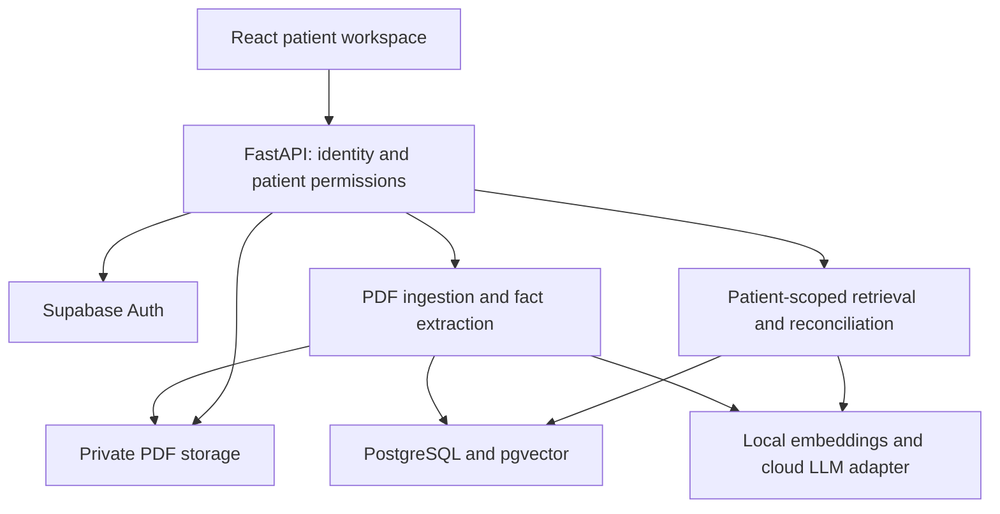

# CareLens AI

**Evidence-backed patient history: compare, verify, and update.**

AI INNOVATE 2026 · Problem 2: Patient History Retrieval  
Team: Varun Yadav T, Sakthivel, Rakshana

> Status: proposed hackathon implementation plan. This document describes intended behavior, not completed or validated capabilities. Use synthetic patient data only.

## Project idea

CareLens helps authorized clinic staff understand a patient's scattered consultation notes, reports, medication records, procedures, and follow-ups. It organizes recorded events into a timeline and answers questions with original document evidence.

Its signature workflow is **Compare → Verify → Update**: compare recorded treatment cycles, inspect supporting sources, then upload a new report and see which facts changed.

The differentiating layer is record reconciliation: connect requested tests with available results, expose contradictory facts, and preserve unresolved information. These are proposed differentiators, not claims of market uniqueness.

## Problem and users

Staff must manually search multiple records to reconstruct patient history. Relevant facts may be hard to locate, reports may be absent from the available collection, and documents may disagree.

Primary users: authorized doctors and clinic staff reviewing historical information. CareLens retrieves and organizes records; clinicians retain responsibility for medical decisions.

## MVP and priorities

| Priority | Capability | Acceptance condition |
|---|---|---|
| P0 | Staff login and patient access | Unauthorized patient requests are denied before retrieval |
| P0 | Patient directory and text-PDF import | Records are associated with the correct synthetic patient |
| P0 | Cited Q&A | Important factual statements include a document, page, and supporting excerpt |
| P0 | Evidence viewer | Clicking a citation opens the authorized original PDF page |
| P0 | Timeline | Dated events retain their original sources; unknown dates stay unknown |
| P1 | Cycle comparison | Recorded cycle identifiers group events into a side-by-side view |
| P1 | Test/report matching | Explicit requests link to results; ambiguous matches remain unresolved |
| P1 | New-report update | Successful ingestion refreshes affected views and shows a change summary |
| P2 | Conflict review | Contradictory facts show both sources for human review |

If time is limited, deliver P0 reliably, then one complete P1 demonstration. Conflict handling begins with a narrow supported case, such as conflicting procedure dates with a shared procedure identifier.

## Important record states

- **Recorded pending:** a source explicitly says the item is pending.
- **Result not found:** a test request exists, but no matching result was found in the available records. This does not prove the test was never performed.
- **Matched:** available evidence links a request to a result.
- **Needs review:** multiple plausible matches or conflicting facts exist.

No automatic inference of medical necessity, diagnosis, treatment advice, or treatment success. Do not silently resolve conflicting records or guess missing cycle identifiers.

## Proposed technology stack

| Layer | Choice | Responsibility |
|---|---|---|
| Frontend | React + Vite + TypeScript | Patient workspace and interactions |
| UI | Tailwind CSS + shadcn/ui | Consistent components |
| API | Python + FastAPI + Pydantic | Validation, permissions, ingestion, retrieval, reconciliation |
| Database | Supabase PostgreSQL + pgvector | Structured records and vector search |
| Identity | Supabase Auth | Staff identity; API verifies token authenticity and validity |
| Files | Supabase private Storage | Original synthetic PDFs |
| PDF extraction | pdfplumber | Text and page provenance |
| PDF display | PDF.js | Source-page viewing |
| Embeddings | Local Sentence Transformers | Document and query embeddings using the same model/version |
| LLM | Groq initially; Gemini candidate | Evidence-grounded extraction and answer generation |
| Verification | pytest + Playwright | Logic, permissions, and core user flows |
| Packaging | Docker | Reproducible API environment |

The model must be selected after testing structured extraction, answer support, latency, and available quota. Local embeddings require a laptop-capacity check. Keep provider calls behind a small adapter. Do not add a second provider before the primary path works.

Free-tier-first plan: Supabase for managed services, local embeddings, a quota-limited LLM API, and local backend execution for the initial demo. Frontend hosting may use Vercel Hobby where eligible. Public backend hosting remains undecided pending event requirements and current limits. Do not promise unlimited free use or production clinical suitability.

Provider references: [Supabase plans](https://supabase.com/pricing), [Groq limits](https://console.groq.com/docs/rate-limits), [Gemini pricing](https://ai.google.dev/gemini-api/docs/pricing), [Vercel Hobby](https://vercel.com/docs/plans/hobby).

## Architecture



### Ingestion

1. Verify staff identity and upload permission for the selected patient.
2. Validate file size/type and reject unreadable, encrypted, or scanned PDFs with an actionable message in the initial version.
3. Save an immutable original and its hash; prevent accidental duplicate ingestion.
4. Extract text per page and create chunks retaining patient, document, page, and excerpt identifiers.
5. Extract candidate events and test requests/results into a validated schema. Each fact must reference supporting text; uncertain fields remain unknown or require review.
6. Embed chunks and persist facts with provenance. Reconcile supported request/result pairs using identifiers, test type, dates, and recorded cycle information.
7. Mark ingestion complete, increment the patient's record version, invalidate affected cached outputs, and show changes. Failed ingestion must not appear complete.

### Questions and answers

1. Verify access to the requested patient on every request.
2. Retrieve only that patient's authorized chunks using keyword and vector search. Apply patient filtering inside retrieval, before any evidence reaches the LLM.
3. Use structured facts for cycle comparisons and request/result status; use retrieved passages for narrative context.
4. Ask the LLM for an answer grounded in the supplied evidence and explicit source IDs. Treat document instructions as untrusted text.
5. Validate returned source IDs against the retrieved set. Check claim support in evaluation; valid IDs alone do not prove an answer is correct.
6. Return supported information and state limitations. Insufficient evidence produces a clear inability to verify, rather than an invented answer.
7. Log the access action without storing unnecessary sensitive prompt content.

### Security boundary

React contains no LLM key or Supabase service-role secret. FastAPI checks role and patient grants for Q&A, timelines, uploads, comparisons, documents, and review actions. Database RLS provides additional protection where requests use user identity. Service-role operations bypass RLS, so explicit backend authorization is mandatory for those paths. Signed document links are issued only after access checks and expire quickly.

## Proposed data model

| Entity | Essential fields |
|---|---|
| patients | id, synthetic display name, record_version |
| staff_profiles | auth user id, role |
| patient_grants | staff id, patient id, allowed actions |
| documents | id, patient id, storage key, hash, ingestion status, uploaded_at |
| chunks | id, patient id, document id, page, text, embedding, embedding model version |
| events | id, patient id, type, recorded date, recorded cycle id, validated payload |
| fact_sources | fact/event id, document id, page, supporting excerpt |
| test_requests | id, patient id, test type, recorded request identifier/date, source |
| test_results | id, patient id, test type, recorded identifiers/dates, source |
| request_result_links | request id, result id, match basis, review state |
| conflicts | patient id, fact references, conflict type, review state |
| audit_events | actor, patient id, action, timestamp, outcome |

A staff review records an interpretation separately; original documents and extracted alternatives remain traceable.

## Proposed API contract

All patient endpoints require a verified bearer token and patient authorization.

| Method | Route | Purpose |
|---|---|---|
| GET | /api/v1/patients | List permitted patients |
| POST | /api/v1/patients/{id}/documents | Upload a PDF; return document id and processing state |
| GET | /api/v1/patients/{id}/documents/{doc_id}/status | Poll ingestion state |
| GET | /api/v1/patients/{id}/timeline | Return source-linked events |
| GET | /api/v1/patients/{id}/brief | Return versioned evidence-backed brief |
| POST | /api/v1/patients/{id}/questions | Return answer, citations, limitations, record version |
| GET | /api/v1/patients/{id}/cycles/compare | Compare specified recorded cycles |
| GET | /api/v1/patients/{id}/reconciliation | Return requests, matches, and unresolved items |
| GET | /api/v1/patients/{id}/changes | Return changes between record versions |
| GET | /api/v1/patients/{id}/documents/{doc_id}/view | Obtain an authorized short-lived document URL |
| POST | /api/v1/patients/{id}/conflicts/{conflict_id}/reviews | Record a staff review |

Agree on JSON schemas before parallel implementation. A citation includes source_id, document_id, page, and excerpt. A question response includes record_version so stale answers can be identified after uploads.

## UI screens

1. Staff login.
2. Authorized patient directory.
3. Patient workspace: snapshot, brief, timeline, records, and Q&A.
4. Cycle comparison with clickable evidence cells.
5. Unresolved-record panel with matching explanations and conflict sources.
6. PDF evidence drawer with page navigation and supporting excerpt.
7. Upload progress and before/after change summary.

Use one compact workspace with tabs/panels rather than building many independent dashboards.

## Team ownership — provisional

| Member | Primary ownership |
|---|---|
| Sakthivel | Extraction, embeddings, retrieval, cited answers, cycle comparison logic |
| Varun Yadav T | API foundation, database, identity/permissions, uploads, matching/update integration |
| Rakshana | React workspace, timeline, comparison UI, evidence viewer, frontend API integration |
| All three | Synthetic fixtures, integration testing, measured impact, slides, demo practice |

Adjust assignments to actual skills. Each API/data boundary needs one agreed contract. Use one repository, short feature branches, frequent commits, and integration checkpoints. Never commit secrets.

## Build order and event plan

- **8 October evening:** repository setup, synthetic records, schemas, identity/API skeleton, frontend connection.
- **9 October morning:** complete patient → question → answer → source-page workflow.
- **9 October afternoon:** timeline, cycle comparison, test/result matching.
- **9 October evening:** upload/update flow; narrow conflict feature if core is stable.
- **9 October night:** permission checks, failure handling, measured benchmark, presentation, recorded backup.
- **10 October before 9 AM:** verify actual demo laptop and environment; freeze risky changes.

Schedule supplied by the team: first evaluation 10 October, 9–11 AM; implementation window 11 AM–1 PM; second evaluation 1–3 PM. A separate submission deadline and judging rubric are not yet confirmed.

## Demo story

Prepare a few synthetic patients. The main case has two explicitly labeled cycles, a recorded test request without a matching result, and two conflicting procedure dates sharing an identifier. Keep a new synthetic result PDF outside the initial collection.

1. Open the main patient and inspect the brief.
2. Ask: “Compare the last two cycles and show unresolved records.”
3. Open supporting evidence for a comparison entry.
4. Inspect the unmatched request and conflicting sources.
5. Upload the new report through the real ingestion path.
6. Show the newly supported match and versioned change summary.
7. Demonstrate that a restricted staff account cannot access another patient.

Outputs must be computed from records, not hardcoded to the demonstration question. Include a paraphrased question and another patient to verify generalization. Label any cached or recorded backup accurately.

## Validation and impact

Create a small answer key before measuring results. Include answerable questions, missing evidence, conflicting records, repeated tests, duplicate uploads, and unauthorized patient requests.

Measure factual support and citation correctness against the answer key, request/result matching correctness, unsupported-answer handling, processing time, and access-control outcomes. Report sample size and failures.

For time savings, compare the same history-retrieval tasks manually and with CareLens, using equivalent record sets and reporting participant count and limitations. Separate PDF ingestion time from question-answer latency. Publish only actual measured results.

## Planned repository layout

```text
carelens-ai/
  frontend/
  backend/
    app/
      api/
      auth/
      ingestion/
      retrieval/
      reconciliation/
      providers/
      schemas/
    tests/
  database/migrations/
  demo-data/
  docs/
  README.md
  .env.example
  .gitignore
```

This is a proposed layout. Installation/run commands should be added after actual dependencies and entrypoints exist; no runnable implementation accompanies this README.

## Deliverables and boundaries

Planned deliverables: working prototype, source repository, short presentation, one-page explanation of manual work removed, and recorded demo backup. Verify these against the original organizer instructions before submission.

Initial boundaries: text-based PDFs, synthetic data, staff-only interface, recorded cycle identifiers, limited matching rules, and a small evaluated dataset. OCR, patient chat, reminders, medical recommendations, and production clinic integration are outside the initial scope.

## Pitch

“CareLens turns scattered patient records into a verifiable case history, showing what happened, what remains unresolved, and what changed when new evidence arrived.”

Success means a reliable, demonstrable workflow with defensible evidence and measured impact. No hackathon outcome is guaranteed.

## Build-start decisions

This revised guide adopts the reference README's explicit ownership, security boundary, folder responsibilities, and integration checkpoints. CareLens adds structured reconciliation and versioned updates. This is the team's canonical specification; additional ideas go into the backlog rather than changing implementation independently.

Freeze these decisions before coding:

- One FastAPI application and one React application; no microservices or agent framework.
- Supabase Auth owns passwords and login sessions. Do not implement a second password database or custom JWT issuer. FastAPI validates Supabase access tokens using the project's supported verification mechanism, including signature, issuer, audience, and expiry.
- React may call Supabase Auth for login/session handling. Patient records, uploads, retrieval, document URLs, and all business actions go through FastAPI. It never calls the LLM or queries clinical tables directly.
- Local embedding candidate: sentence-transformers/all-MiniLM-L6-v2, producing 384-dimensional vectors. Benchmark on the synthetic clinical questions before acceptance. A model change requires re-embedding chunks and changing the index dimension if necessary.
- Choose an available Groq model after a small structured-output and citation test. Configure its exact model identifier rather than hardcoding a guessed name.
- Text-based PDFs only for the first milestone. OCR is a separate backlog item unless organizer data requires it.
- Two application roles initially: staff and admin. Patient grants define who can read/upload/review each patient; role alone does not grant every patient.
- Admin setup can use a seed script. No admin dashboard is required for the first demonstration.

## Detailed module ownership

| Owner | Paths | Contract |
|---|---|---|
| Sakthivel | backend/app/ingestion/, retrieval/, providers/ | Extraction and RAG services accept authorized patient scope and return validated facts/citations |
| Varun | backend/app/api/, auth/, database/, reconciliation/, config/; database/migrations/ | Routes authorize first, call services, persist data, and log outcomes |
| Rakshana | frontend/ | UI consumes the agreed API schemas and handles loading, failures, denied access, and stale outputs |
| Shared; Varun integrates | backend/app/schemas/ | Freeze schemas together; announce changes before merging |
| Shared | demo-data/, docs/, tests | Synthetic fixtures, answer key, acceptance results, presentation |

Sakthivel owns the cycle comparison service; Varun exposes and authorizes its route. Varun owns request/result matching; Sakthivel supplies extracted fields and provenance. Neither independently creates a second fact schema.

### Suggested concrete modules

Backend: main.py, config/settings.py, database/repository.py, auth/dependencies.py, auth/permissions.py, api/router.py, api/patients.py, api/documents.py, api/questions.py, ingestion/parser.py, ingestion/chunker.py, ingestion/extractor.py, ingestion/service.py, retrieval/embeddings.py, retrieval/search.py, retrieval/generator.py, retrieval/citations.py, retrieval/comparison.py, providers/llm.py, reconciliation/matching.py, reconciliation/conflicts.py, reconciliation/changes.py, schemas/contracts.py.

Frontend: src/pages/Login.tsx, Patients.tsx, PatientWorkspace.tsx; src/components/Timeline.tsx, CaseBrief.tsx, QuestionPanel.tsx, CitationLink.tsx, EvidenceDrawer.tsx, CycleComparison.tsx, UnresolvedRecords.tsx, DocumentUpload.tsx; src/services/api.ts; src/auth/AuthProvider.tsx; src/types/contracts.ts.

## Environment contract

Create .env.example with placeholders only. Actual .env files must be ignored by Git.

Backend variables:

```dotenv
SUPABASE_URL=
SUPABASE_PUBLISHABLE_KEY=
SUPABASE_SERVICE_ROLE_KEY=
GROQ_API_KEY=
LLM_MODEL=
EMBEDDING_MODEL=sentence-transformers/all-MiniLM-L6-v2
STORAGE_BUCKET=patient-documents
CORS_ORIGINS=http://localhost:5173
MAX_UPLOAD_BYTES=10485760
MAX_QUESTION_CHARS=2000
```

Frontend variables:

```dotenv
VITE_API_BASE_URL=http://localhost:8000
VITE_SUPABASE_URL=
VITE_SUPABASE_PUBLISHABLE_KEY=
```

The publishable key is designed for public-client use; service-role and LLM keys are backend-only. Use the server key only where necessary, and always perform explicit authorization before privileged reads/writes. Never print secrets in logs.

## Shared JSON contracts

Identifiers below are illustrative synthetic values. Actual patient and document IDs should use a consistent database type.

Question request body:

```json
{"question":"What tests were requested in cycle C2?"}
```

Question response shape:

```json
{
  "patient_id":"P001",
  "record_version":3,
  "status":"answered",
  "answer":"Test A was requested during cycle C2.",
  "claims":[{"text":"Test A was requested during cycle C2.","source_ids":["S1"]}],
  "sources":[{
    "source_id":"S1",
    "document_id":"D001",
    "document_name":"cycle_2_consultation.pdf",
    "page":1,
    "excerpt":"Cycle C2: Test A requested."
  }],
  "limitations":[]
}
```

Allowed answer states: answered, partial, insufficient_evidence. No confidence percentage is required. Sources are mapped from retrieved evidence, not arbitrary LLM-generated filenames. Unavailable LLM service returns a clear error; an existing structured timeline may still be shown, but never masquerades as a freshly generated answer.

Timeline event contract:

```json
{
  "event_id":"E001",
  "patient_id":"P001",
  "event_type":"test_request",
  "event_date":"2026-09-15",
  "cycle_id":"C2",
  "description":"Test A requested",
  "source_ids":["S1"],
  "review_state":"unreviewed"
}
```

Unknown date/cycle fields are null. event_type is restricted to consultation, test_request, test_result, procedure, medication, follow_up, or other. Extraction schema validation verifies field shapes; it does not certify medical correctness.

## Matching rules for the hackathon

Start with explicit request identifiers in the synthetic records. A candidate result must belong to the same patient and have compatible test type and identifiers. Require matching cycle IDs when both are present. When identifiers are absent, use a documented conservative date/type rule and flag ambiguous pairs for review. Repeated tests must not be matched by test name alone.

Never mark every request for a test complete because one result arrived. Store the match basis and source references. Staff reviews may confirm or reject proposed links. An upload whose patient identifier contradicts the selected patient is rejected or quarantined for review rather than silently indexed.

## Upload and update implementation

For the initial small-document prototype, process after creating a persisted document record and expose pending, processing, completed, and failed states. The implementation can use a lightweight in-process task, but must document that it is not a durable job queue. On restart, stale processing records become failed/retryable; do not pretend processing survived.

Only publish a new record version after facts and chunks are committed consistently. Incomplete files cannot influence answers. Persist a change record containing new events, newly linked results, and new conflicts. On the frontend, clear or mark answers from older versions as stale.

## First integration checkpoint

Before building differentiators, all three members must demonstrate this together:

1. A real staff session reaches FastAPI with a verified token.
2. The API lists a permitted synthetic patient.
3. A PDF upload finishes and yields stored page chunks.
4. A question retrieves that patient's evidence and returns cited claims.
5. Clicking a citation opens the correct PDF page.
6. A restricted account is denied access to another patient's API and PDF.

Frontend mock JSON is acceptable while APIs are being built, but the checkpoint and final demo must use the actual backend. Mark mock mode visibly during development.

## Demo fixtures and acceptance checklist

Create three synthetic patients and two staff accounts with different grants. Main patient: two labeled cycles, two requests for the same test with distinct identifiers, one unmatched request, and a narrow procedure-date conflict. Second patient: a simpler history to verify generalization. Third patient: restricted to the second account.

Keep the later report outside the initial seed ingestion. Ensure every expected answer can be traced to fixture text.

- [ ] Invalid/expired token denied.
- [ ] Patient filtering occurs before retrieval and LLM calls.
- [ ] Direct document URLs and ingestion-status routes enforce patient access.
- [ ] Missing evidence produces an honest limitation.
- [ ] Document instructions cannot override application permissions.
- [ ] Every displayed citation refers to an authorized stored source/page.
- [ ] Repeated tests are not incorrectly merged.
- [ ] Duplicate bytes do not create duplicate timeline facts.
- [ ] Conflicting dates retain both source assertions.
- [ ] New-report ingestion updates only supported matches.
- [ ] Ingestion failure leaves prior history usable.
- [ ] A new record version invalidates stale briefs/answers.
- [ ] Paraphrased questions and the second patient work.
- [ ] Recorded backup and presentation are ready.

## Git and integration discipline

Use feature/ai-rag, feature/backend-security, and feature/frontend branches. Varun coordinates merges; all members review shared-schema changes. Keep pull requests small, exclude credentials, and pull the integrated main branch at each checkpoint. Commit migrations and synthetic fixtures with the relevant change.

Integrate continuously: API scaffolding and mock contract tonight; real cited-answer workflow tomorrow morning; differentiators tomorrow afternoon; final verification tomorrow evening. Deployment, OCR, voice, multilingual support, and additional dashboards cannot displace the core workflow.

## Start building now: first assignments

**Sakthivel:** create extraction/chunk schemas and the page-preserving parser; test local embeddings and one provider request; implement a small RAG service against the agreed repository interface.

**Varun:** create FastAPI app, settings, Supabase migrations and private bucket; seed identities/grants; implement verified-auth dependencies, patient list/detail/document routes, and audit persistence. Expose GET /health for local readiness without secrets.

**Rakshana:** scaffold React/TypeScript; implement login, patient list, workspace, question panel, citations, and PDF drawer against the agreed response shape. Connect the first live endpoint immediately rather than waiting for all backend features.

**Together:** agree the contracts, create the synthetic answer key, verify the first integration checkpoint, then extend to reconciliation. Add runnable setup commands only once scaffolded entrypoints, dependency files, migrations, and scripts have actually been tested.


## Starter package
See docs/START_HERE.md for actual run commands. Updated ownership: Sakthivel owns AI/RAG; Varun owns backend/security/matching; Rakshana owns frontend. Earlier ownership tables are superseded. All features remain planned except the starter health endpoint and connection screen.
